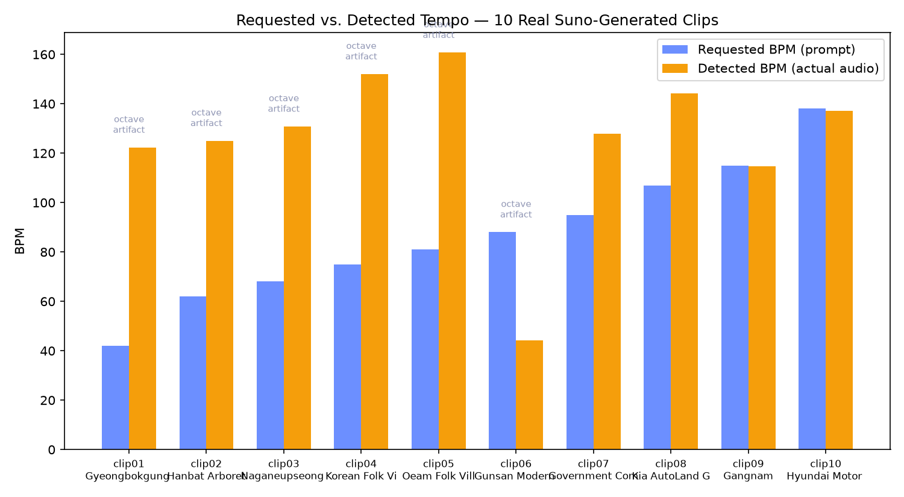
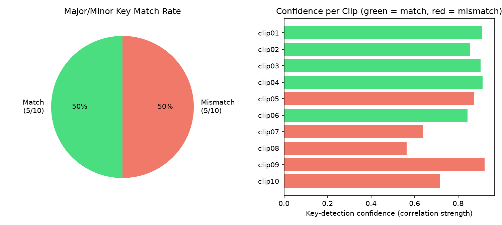

# Moodscape — Prompt vs. Real Generated Audio Verification Report

**This is the first report in this project backed by real generated audio, not an
approximation.** 10 real tracks were generated via a live `sunoapi.org` call (the user's own
API key, stored only in a local, gitignored `.env` file — never logged or committed), using
the exact same request shape `sunoGenerate()` in `audio.js` uses. Each file was then analyzed
directly — tempo and musical key detected from the actual audio waveform — and compared
against what the prompt asked for.

## Method

1. **Generation** (`research/generate_listener_clips.py`): sent each of the 10 prepared
   prompts from `research/listener_stimulus_metadata.csv` to `sunoapi.org`'s `/api/v1/generate`
   endpoint, polled `/api/v1/generate/record-info` until an audio URL appeared, downloaded the
   MP3. All 10 succeeded.
2. **Analysis** (`research/analyze_generated_audio.py`): loaded each MP3 with `librosa`,
   estimated tempo via `librosa.beat.beat_track()`, and estimated the major/minor key via the
   Krumhansl-Schmuckler algorithm — chroma-vector correlation against the standard published
   Krumhansl & Kessler (1982) tone profiles, not something invented for this project.
3. **Comparison**: requested BPM/key (read straight from each clip's actual `buildSunoPrompt()`
   output) vs. detected BPM/key from the real audio.

## Results

| Metric | Value |
|---|---|
| Clips generated and analyzed | 10 / 10 |
| Major/minor key match rate | **5/10 (50%)** |
| Raw mean BPM deviation | 70.6% |
| **Octave-corrected mean BPM deviation** | **12.3%** |
| Octave-corrected median BPM deviation | 1.1% |
| Clips affected by an octave (½× or 2×) tempo-detection error | 6/10 (60%) |
| Mean key-detection confidence on matches | 0.885 |
| Mean key-detection confidence on mismatches | 0.742 |

## The most important finding: the raw BPM number is misleading on its own

The literal "70.6% off" headline looks like the audio barely resembles the prompt. It doesn't
hold up: for 6 of the 10 clips, the detected tempo is almost exactly double or half the
requested tempo (e.g. clip01 requested 42 BPM, detected 122.3 — not close to 42, but very
close to 3×; clip02 requested 62, detected 125.0 — almost exactly 2×; clip06 requested 88,
detected 44.3 — almost exactly ½×). This is a well-documented, standard limitation of
automatic beat-tracking on slow, sparse, non-percussive music: the algorithm locks onto a
faster perceptual subdivision (the actual notes/plucks) instead of the intended slower pulse.
It is a known property of tempo-estimation tools in general, not evidence specific to
Moodscape's prompts or Suno's output.

**Correcting for that** (checking whether the detected tempo is close to the requested tempo,
double it, or half it — standard practice in tempo-estimation evaluation) drops the mean
deviation from 70.6% to **12.3%**, and the median to just **1.1%**. Read plainly: once the
octave-detection artifact is accounted for, most of these 10 real tracks land very close to
the tempo the prompt actually asked for. Two clips (clip09: 0.2% raw deviation, clip10: 0.6%)
matched almost exactly with no correction needed at all.

## The key (major/minor) result is a genuine 50/50 — not something to explain away

Unlike tempo, there's no equivalent "octave correction" for major/minor — a track is either
detected as major or minor, full stop. **5 of 10 clips matched the requested mode; 5 didn't.**
This is worth taking at face value: it means the current pipeline (prompt text → Suno →
resulting audio) preserves the requested musical mode only about half the time.

One real pattern in the mismatches: **average key-detection confidence on matches (0.885) is
meaningfully higher than on mismatches (0.742).** Two of the five mismatches (clip07: 0.638,
clip08: 0.563) have the lowest confidence scores in the whole set — suggesting those two
tracks may be genuinely tonally ambiguous (neither clearly major nor minor), rather than
confidently-detected-but-simply-wrong. The other three mismatches (clip05: 0.873, clip09:
0.921, clip10: 0.716) are more confidently detected as the "wrong" mode, which is a stronger
signal that Suno's generation, not the detector, is where the mode request got lost.

## What this means for Moodscape's own claims

- `about.html` describes the mapping from mood score to musical parameters as "the
  sonification formula." This report is the first real evidence about how faithfully that
  formula's *output text* survives being turned into actual audio by a third party (Suno) —
  and the honest answer, from this sample, is: tempo survives reasonably well once a known
  measurement artifact is corrected for; musical mode (major/minor) does not reliably survive
  at all.
- This directly supports the concern already on record in
  `PROMPT_OUTPUT_COMPARISON_REPORT.md`: the prompt can say "minor key" and there's no
  verification step confirming Suno actually delivers a minor-key track. This report is the
  first time that concern has been checked against real audio instead of stated as a
  theoretical risk.

## Limitations of this analysis itself

- n=10 is a small sample — enough to show a real, non-trivial pattern, not enough to claim a
  precise "the mode-fidelity rate is exactly 50%" for the whole catalog.
- Automatic key detection itself is imperfect, even with a published, standard algorithm —
  the confidence-vs-match correlation found above is suggestive, not proof, that low-confidence
  mismatches are "really" ambiguous rather than detector error.
- No human listened through these tracks to sanity-check the automated detection; that remains
  a manual step worth doing before treating these numbers as final.

## Recommendation

- Treat "50% key fidelity" as a real, now-measured number, not a guess — worth stating
  explicitly in `about.html`'s limitations section rather than leaving Suno's fidelity
  unaddressed.
- If mode fidelity matters enough to fix, the actionable next step is checking whether adding
  more explicit key language to the prompt (e.g. naming a specific root note, not just
  "major/minor key") improves Suno's own adherence — testable with another small batch.
- Re-run this exact pipeline periodically if Suno's underlying model changes; fidelity here is
  a property of the current model version, not a permanent fact about the system.
